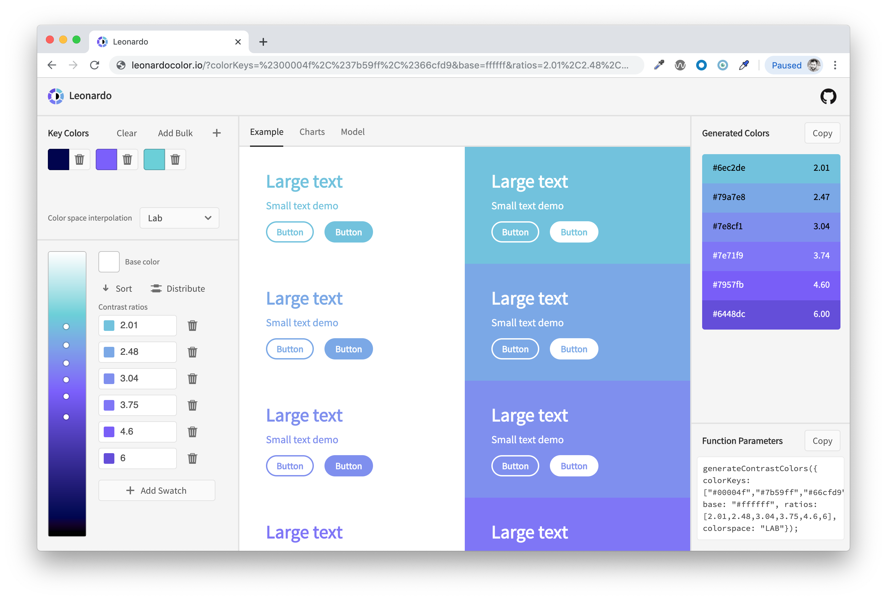

# Leonardo
Authoring adaptive color palettes for generating color based on a desired contrast ratio.

## Project Goals
To make it easier for designers and engineers to leverage color science to create custom interpolations for a value scale, and to make it easier for designers and engineers to conform to [WCAG minimum contrast standards](https://www.w3.org/TR/WCAG21/#contrast-minimum) by using contrast ratio as the starting point, rather than a post-color-selection auditing process.

1. [Leonardo web application](leonardo-web-application)
2. [Show me a demo](#show-me-a-demo)
3. [What is "adaptive color"?](#what-is-adaptive-color)
4. [Using Leonardo](#using-leonardo)
5. [API Reference](#api-reference)
6. [Why are not all contrast ratios available?](#why-are-not-all-contrast-ratios-available)
7. [D3 Color](#d3-color)
8. [Contributing](#contributing)
9. [Licensing](#licensing)


## Leonardo web application
The Leonardo web application is a tool for designers and engineers to collaboratively build color scales for use in user interfaces. The tool exposes an interface to the `generateContrastColors()` API and displays visual aids for modifying the selection of a variable color and the target contrast ratios (swatches) to produce. The URL updates with your parameters for easily sharing links to team mates, and the app displays the specific config parameters when designers send you a version that they approve.



## Show me a demo
*(coming soon)*
Sometimes it's easier to express what you can do by showing you. Take a look at this demo app and play around with the brightness and contrast controls. These are dynamically regenerating the color palette using `generateContrastColors()` functions, which allows for more aesthetically pleasing changes to the entire UI color system as the end user (you) adjusts their settings.

## What is adaptive color?
I've written about this concept in more detail at the following links. The goals of this project are to aid in fulfilling the tooling necessary to make adaptive color palettes available to designers and engineers.

- [Part 1: Adaptive Color in Design Systems](https://medium.com/thinking-design/adaptive-color-in-design-systems-7bcd2e664fa0)
- [Part 2: Introducing Adaptive Color Palettes](https://medium.com/thinking-design/introducing-adaptive-color-palettes-111b5842fc88)
- [Part 3: Adaptive Color in Spectrum, Adobe's Design System](https://medium.com/thinking-design/adaptive-color-in-spectrum-adobes-design-system-feeeec89a2c7)

## Using Leonardo
### Installing
```
npm i @adobe/leonardo-contrast-colors
```
(coming soon)

Pass your colors and desired ratios. See additional options below.
```
generateContrastColors({colorKeys: ["#ff00ff"], base: "#ffffff", ratios: [4.5]}); // returns rgb value
```

Or, pass a scale function so you can reuse the color scale elsewhere
```
myColors = createScale({colorKeys: ['#57B8D9', '#7B59FF', '#00004F'], colorspace: 'LAB', swatches: 8}); // returns 8 colors and parameters

generateContrastColors( myColors,{ratios: [3.5, 4.5, 7], base: "#ffffff"}) // returns contrast-based colors
```

### Local setup
- install dependencies `npm i`
- run local server `npm run serve`
- open `http://localhost:8001`


## API Reference

### generateContrastColors

Primary function used to generate colors based on target contrast ratios. Parameters are destructured and need to be explicitly called, such as `colorKeys: ["#f26322"]`.

```
generateContrastColors({colorKeys, base, ratios, colorspace})
```

**colorKeys** *[array]*: list of colors referenced to generate a lightness scale. Much like [key frames](https://en.wikipedia.org/wiki/Key_frame), key colors are single points by which additional colors will be interpolated between.

**base** *string*: references the color value that the color is to be generated from.

**ratios** *[array]*: list of numbers to be used as target contrast ratios.

**colorspace** *string*: the colorspace in which the key colors will be interpolated within. Below are the available options:

- [Lch](https://en.wikipedia.org/wiki/HCL_color_space)
- [Lab](https://en.wikipedia.org/wiki/CIELAB_color_space)
- [CAM02](https://en.wikipedia.org/wiki/CIECAM02)
- [HSL](https://en.wikipedia.org/wiki/HSL_and_HSV)
- [HSLuv](https://en.wikipedia.org/wiki/HSLuv)
- [HSV](https://en.wikipedia.org/wiki/HSL_and_HSV)
- [RGB](https://en.wikipedia.org/wiki/RGB_color_space)

### createScale

Alternatively, you can pass a **scale** as your arguments for the `getContrastColors()` function. This is especially helpful if you want to reuse a color scale in other instances.

```
createScale({swatches, colorKeys, colorspace, shift, fullScale})
```

**swatches** *number* Amount of colors you wish to return from the scale. Used in creating sequential color palettes, where contrast is not considered in generation of color values.

**shift** *number* This is an exponential shift applied to the color scale for adjusting the transition from light to dark.

**fullScale** *boolean* (default true) This determines whether you generate a scale that goes to full black and white. False clamps the scale to your lightest and darkest key colors. **In development**


## Why are not all contrast ratios available?
You may notice the tool takes an input (target ratio) but most often outputs a contrast ratio slightly higher. This has to do with the available colors in the RGB color space, and the math associated with calculating these ratios.

For example let's look at blue and white.
Blue: rgb(0, 0, 255)
White: rgb(255, 255, 255)
Contrast ratio: **8.59**:1

If we change any one value in the RGB channel for either color, the ratio changes:
Blue: rgb(0, **1**, 255)
White: rgb(255, 255, 255)
Contrast ratio: **8.57**:1

If 8.58 is input as the target ratio with the starting color of blue, the output will not be exact. This is exaggerated by the various colorspace interpolations.

Since the WCAG requirement is defined as a *minimum contrast requirement*, it should be fine to generate colors that are a little *more* accessible than the minimum.

## D3 Color
This project is currently built using [D3 color](https://github.com/d3/d3-color). Although functionality is comparable to [Chroma.js](https://gka.github.io/chroma.js/), the choice of D3 color is based on the additional modules available for state-of-the-art [color appearance models](https://en.wikipedia.org/wiki/Color_appearance_model), such as [CIE CAM02](https://gramaz.io/d3-cam02/).

The `createScale()` function is basically a wrapper function for creating a d3 linear scale for colors, with a few enhancements that aid in the `generateContrastColors()` function.

The Leonardo web app leverages d3 for additional features such as generating 2d and 3d charts.

## Contributing
Contributions are welcomed! Read the [Contributing Guide](./.github/CONTRIBUTING.md) for more information.

## Licensing
This project is licensed under the Apache V2 License. See [LICENSE](LICENSE) for more information.
